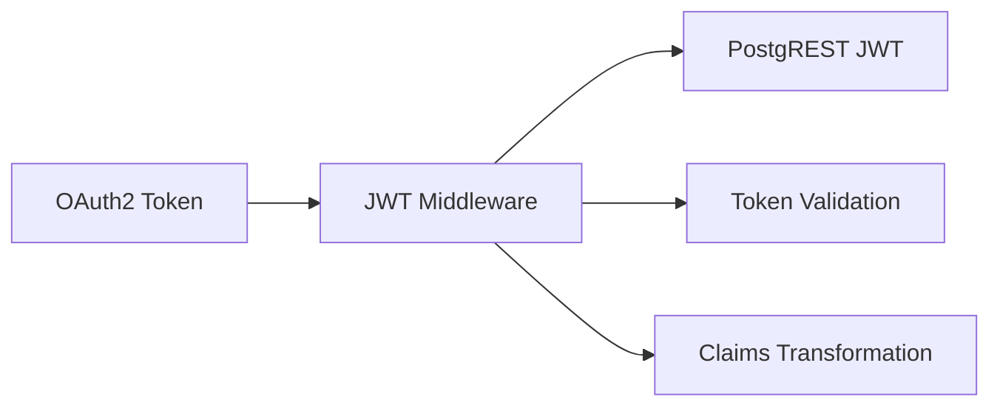

# JWT Middleware Guide

## Overview
The JWT Middleware is a crucial component that transforms OAuth2 tokens into PostgREST-compatible JWTs. This document explains its implementation and usage.

## Architecture


## Implementation Details

### 1. Token Transformation
```python
# Example token transformation
def transform_token(oauth_token):
    # Decode and validate OAuth token
    decoded = jwt.decode(oauth_token, verify=False)
    
    # Transform claims for PostgREST
    transformed_claims = {
        "role": decoded["sub"],
        "exp": decoded["exp"],
        "iat": decoded["iat"],
        "aud": "demo_app"
    }
    
    # Sign new token
    return jwt.encode(
        transformed_claims,
        JWT_SECRET,
        algorithm="HS256"
    )
```

### 2. Security Features
- Token validation
- Claim verification
- Signature checking
- Expiration handling
- Audience validation

### 3. Configuration
```env
# Environment Variables
POSTGREST_URL=http://server:3000
PGRST_JWT_SECRET=your_jwt_secret_here
AUTHENTIK_URL=https://your-oauth-provider.com
```

## API Endpoints

### 1. Token Transformation
```
POST /transform
Content-Type: application/json

{
    "token": "oauth_token_here"
}
```

Response:
```json
{
    "token": "transformed_jwt_here",
    "expires_in": 3600
}
```

### 2. Token Validation
```
POST /validate
Content-Type: application/json

{
    "token": "jwt_to_validate"
}
```

## Testing
The middleware includes test endpoints to verify:
- Token transformation
- Claim mapping
- Signature validation
- Error handling

## Common Issues and Solutions

1. **Invalid Token Format**
   - Check token structure
   - Verify required claims
   - Validate signatures

2. **Claim Mismatches**
   - Verify claim mapping
   - Check required fields
   - Validate data types

3. **Expiration Issues**
   - Check token expiration
   - Verify clock skew
   - Handle token refresh

## Best Practices
1. Always validate tokens
2. Use secure signing keys
3. Implement proper error handling
4. Log security events
5. Monitor token usage
6. Implement rate limiting
7. Use secure communication 