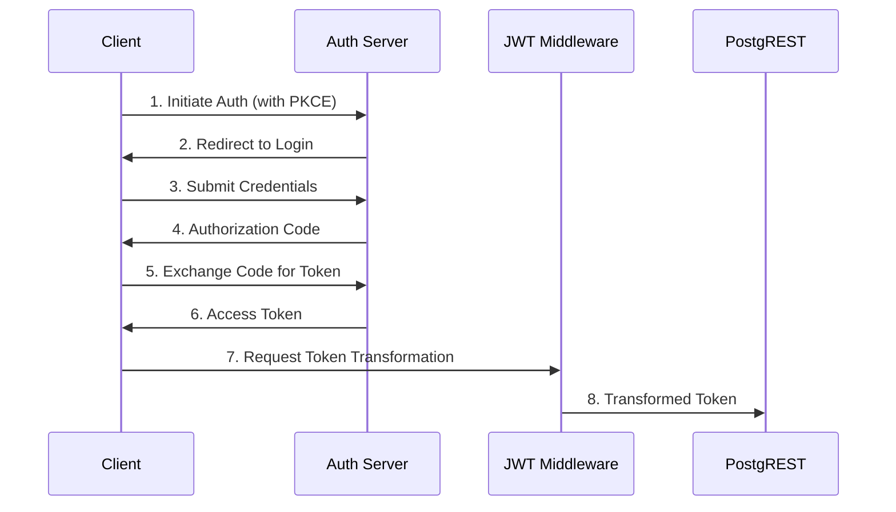

# OAuth2 Implementation Guide

## Overview
This document details the OAuth2 implementation in our demonstration project, focusing on the authorization code flow with PKCE (Proof Key for Code Exchange).

## Flow Diagram


## Implementation Details

### 1. Frontend Configuration
```typescript
// Angular OAuth2 Configuration
export const authConfig: AuthConfig = {
  issuer: 'https://your-oauth-provider.com',
  redirectUri: window.location.origin + '/callback',
  clientId: 'your-client-id',
  responseType: 'code',
  scope: 'openid profile email',
  showDebugInformation: true,
  usePKCE: true
};
```

### 2. Token Storage
- Access tokens are stored in memory
- Refresh tokens are stored securely
- Token expiration is handled automatically

### 3. Security Considerations
- PKCE implementation for public clients
- Secure token storage
- Token refresh mechanism
- CSRF protection

## Testing
The project includes test endpoints to verify:
- Authentication flow
- Token validity
- Scope enforcement
- Error handling

## Common Issues and Solutions
1. **Invalid Token Format**
   - Ensure proper JWT structure
   - Verify token claims
   - Check token expiration

2. **Scope Issues**
   - Verify required scopes
   - Check token claims
   - Validate permissions

3. **PKCE Errors**
   - Verify code verifier/challenge
   - Check code exchange flow
   - Validate redirect URIs

## Best Practices
1. Always use HTTPS
2. Implement proper error handling
3. Use secure token storage
4. Implement token refresh
5. Validate all tokens
6. Use appropriate scopes
7. Implement proper logging 