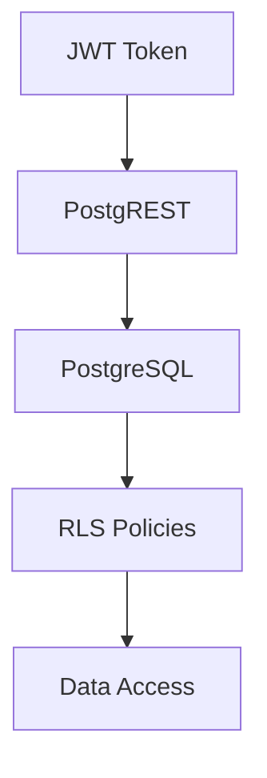

# Row-Level Security (RLS) Guide

## Overview
This document explains the implementation of Row-Level Security in PostgreSQL and how it integrates with PostgREST and JWT authentication.

## Architecture


## Implementation Details

### 1. Table Setup
```sql
-- Example table with RLS
CREATE TABLE api.test_data (
    id SERIAL PRIMARY KEY,
    user_id TEXT NOT NULL,
    data TEXT NOT NULL,
    created_at TIMESTAMP WITH TIME ZONE DEFAULT CURRENT_TIMESTAMP
);

-- Enable RLS
ALTER TABLE api.test_data ENABLE ROW LEVEL SECURITY;

-- Create policies
CREATE POLICY test_data_select_policy ON api.test_data
    FOR SELECT
    USING (user_id = current_setting('request.jwt.claims', true)::json->>'role');

CREATE POLICY test_data_insert_policy ON api.test_data
    FOR INSERT
    WITH CHECK (user_id = current_setting('request.jwt.claims', true)::json->>'role');
```

### 2. JWT Integration
- Role claim maps to user_id
- Policies use JWT claims
- Secure by default

### 3. Testing Policies
```sql
-- Test RLS policies
SET request.jwt.claims TO '{"role": "test_user"}';
SELECT * FROM api.test_data;  -- Should only show test_user's data
```

## Security Considerations

### 1. Policy Types
- SELECT policies
- INSERT policies
- UPDATE policies
- DELETE policies

### 2. Best Practices
- Principle of least privilege
- Default deny
- Explicit allow
- Regular policy review

### 3. Common Patterns
```sql
-- User-specific access
CREATE POLICY user_specific ON api.table
    USING (user_id = current_user);

-- Role-based access
CREATE POLICY role_based ON api.table
    USING (role = current_setting('request.jwt.claims', true)::json->>'role');

-- Time-based access
CREATE POLICY time_based ON api.table
    USING (created_at > NOW() - INTERVAL '1 day');
```

## Testing RLS

### 1. Unit Tests
```sql
-- Test user access
SET request.jwt.claims TO '{"role": "user1"}';
INSERT INTO api.test_data (user_id, data) VALUES ('user1', 'test');
SELECT * FROM api.test_data;  -- Should show only user1's data

-- Test different user
SET request.jwt.claims TO '{"role": "user2"}';
SELECT * FROM api.test_data;  -- Should show no data
```

### 2. Integration Tests
- Test with PostgREST
- Verify JWT claims
- Check policy enforcement
- Validate error handling

## Common Issues and Solutions

1. **Policy Violations**
   - Check JWT claims
   - Verify policy conditions
   - Review table permissions

2. **Performance Issues**
   - Optimize policy conditions
   - Use appropriate indexes
   - Monitor query performance

3. **Security Gaps**
   - Regular policy review
   - Security testing
   - Audit logging

## Best Practices
1. Enable RLS by default
2. Use explicit policies
3. Regular security reviews
4. Comprehensive testing
5. Proper error handling
6. Audit logging
7. Performance monitoring 